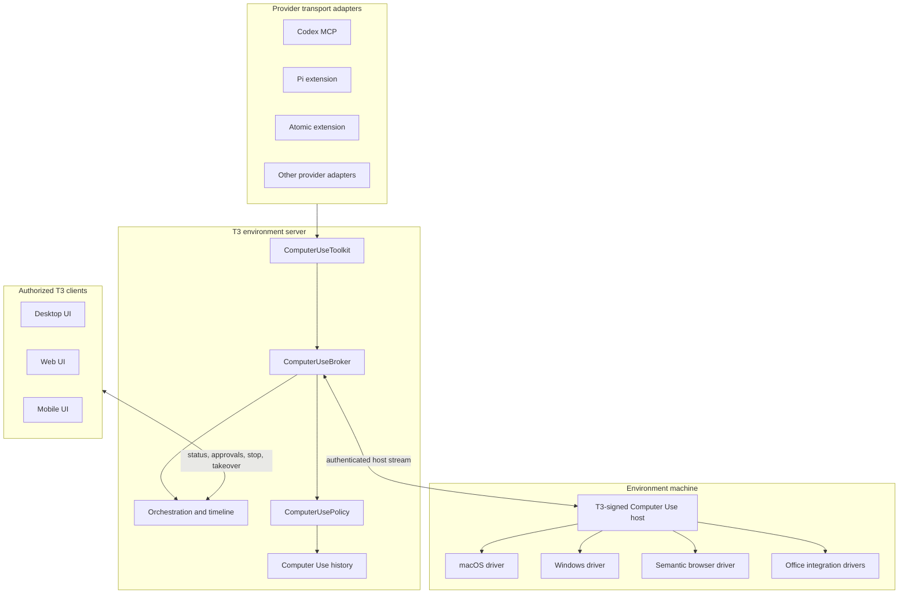

# T3 Computer Use specification

> Status: proposed target architecture and product acceptance contract. The current Codex bridge is
> documented separately in [Codex Computer Use](./providers-codex-computer-use.md) and does not
> satisfy this specification.

This document defines the feature-complete T3 Code Computer Use capability. It converts the verified
gaps against ChatGPT Computer Use into buildable product requirements, module seams, security rules,
provider decisions, delivery slices, and release gates.

The parity baseline is the official [ChatGPT Computer Use documentation][chatgpt-computer-use] and
the [OpenAI computer-use tool guide][openai-computer-use]. The baseline includes macOS and Windows
GUI control, app approvals, sensitive-action confirmation, remote direction, browser control,
Office add-ins, locked use on macOS, stop/takeover, and the screenshot/action loop. T3 may improve
the experience, but it must not call the feature complete while any required capability below is
missing.

Normative words such as **must**, **must not**, **should**, and **may** describe implementation and
release requirements.

## Product definition

T3 Computer Use lets an agent inspect and operate graphical applications on the machine that owns a
T3 environment while the user observes, approves, pauses, stops, or takes over from any authorized
T3 client.

Feature complete means:

- the operating system identifies a T3-owned signed process as the permission owner;
- T3 can operate without ChatGPT, Codex Computer Use, or another vendor's desktop service running;
- Codex, Pi, and Atomic can use the same T3-owned capability and policy;
- desktop, web, and mobile expose consistent status, approval, history, stop, and takeover controls;
- native apps, browsers, and supported Office apps use the strongest available structured control
  route before falling back to visual coordinates;
- macOS and Windows pass the platform acceptance suites;
- macOS locked use passes its additional security gates.

## Goals

1. **T3-owned identity.** Accessibility, screen capture, automation, and signing identity belong to
   T3 and remain stable across updates.
2. **Environment locality.** Actions run on the machine that owns the selected T3 environment, not
   whichever phone or browser happens to render the thread.
3. **Provider neutrality.** Providers call a small T3 tool interface. They do not own OS permission,
   app grants, action policy, screenshots, or audit history.
4. **Structured first.** Use accessibility, browser semantics, or app integrations when available;
   coordinate clicks are the fallback.
5. **Visible control.** The user can always see which target is active, what stage is running, and
   whether the agent is acting, waiting, paused, stopped, or under human control.
6. **Point-of-risk consent.** App access and consequential-action confirmation are separate and
   enforced by T3 even when a provider runs in full-access mode.
7. **Remote ready.** Authorized web and mobile clients can direct and approve work while a same-host
   T3 Computer Use host performs it.
8. **Testable through the interface.** Platform drivers, provider transports, and clients share
   conformance suites instead of carrying provider-specific parity claims.

## Non-goals and prohibitions

- Computer Use must not automate terminal applications or T3 Code itself through the agent-facing
  tool interface. This prevents bypassing T3's command, filesystem, and approval policies.
- Computer Use must not approve administrator authentication, OS security dialogs, Accessibility,
  Screen Recording, or other privacy permission prompts.
- App access must not imply authority to delete data, publish content, change security settings,
  transmit secrets, or complete financial actions.
- Screen content, browser pages, documents, emails, chats, and tool output must not be treated as
  user authorization.
- A remote web or mobile client must never register as the native host for the environment machine.
- Screenshots and raw accessibility trees must not be persisted in orchestration events or ordinary
  logs.
- Linux native GUI control is not required for ChatGPT parity. Linux clients must report the native
  capability as unsupported rather than expose a nonfunctional switch. Semantic control of T3's
  built-in browser may remain available where supported.

## Domain model

### Computer Use host

The signed T3 process on the environment machine that owns OS permissions and executes native UI
operations. On macOS this is a T3-signed helper embedded in the desktop app. On Windows it is a
T3-signed helper or broker process. A CLI-only server has no native host unless a signed local T3
companion registers through the local bootstrap flow.

### Agent caller

The provider session requesting an observation or action. The caller can be Codex, Pi, Atomic, or a
later provider adapter. It receives tools but never receives OS permission or direct helper access.

### Control lease

A short-lived exclusive grant that binds one provider session and turn to one Computer Use host.
Only one lease may issue actions on an environment at a time. Human takeover, interruption, host
disconnect, session stop, or turn completion closes the lease and fails queued work deterministically.

### Computer target

An app, window, browser tab, or supported add-in surface identified by stable platform identity.
Display names are presentation only. Policy decisions bind to the stable identity and host.

### Observation

A point-in-time target description containing a bounded screenshot, structured accessibility or
semantic state, target identity, dimensions, and a unique `observationId`. Coordinate actions must
name the observation they were derived from so stale actions can be rejected.

### Action batch

An ordered list of UI actions applied to one target and one observation. The host stops at the first
failure or policy boundary, reports completed actions, and returns a fresh observation.

### App grant

A user decision permitting a caller to inspect or operate one computer target. The grant records an
explicit access level (`observe` or `operate`) as well as its duration: one action, one turn, one
provider session, or persistent for that environment host. An observation grant must not silently
expand into an operation grant. Persistent grants are revocable in T3 settings.

### Action confirmation

A separate point-of-risk decision for a consequential action. An app grant never satisfies an
action confirmation.

### Takeover

A user action that immediately closes the active control lease, releases synthetic input, and gives
the physical user exclusive control. Resuming agent control requires a new lease.

### Semantic browser control

Browser automation through DOM, accessibility, extension, or browser-protocol semantics. It is a
separate structured capability with the same app-grant, action-confirmation, audit, and takeover
policy as native Computer Use.

## Architecture decision

Computer Use is an environment capability, not a provider feature. T3 owns the host, policy, state,
and audit trail; provider adapters only expose the capability through their native tool transport.

The existing [preview automation broker][preview-broker] proves the host-stream pattern, capability
negotiation, request correlation, disconnect cleanup, and provider-session pinning. Computer Use
must reuse those lessons, but it must not reuse preview's focused-client host selection: native
control is valid only from a signed same-machine host.

## Deep modules and seams

### `ComputerUseBroker`

The server-side module that owns host registration, capability negotiation, control leases, request
correlation, timeouts, cancellation, backpressure, and disconnect cleanup.

Its external interface should remain small:

- `connect(host)` returns the host request stream;
- `respond(response)` resolves one correlated host request;
- `invoke(scope, operation, input)` executes one policy-checked operation;
- `stop(scope, reason)` closes the matching lease and pending work.

Callers do not select processes, sockets, drivers, or remote clients. Tests use the same interface
with a fake host adapter.

### `ComputerUsePolicy`

The module that resolves computer-target identity, app grants, action risk, user confirmations,
provider/thread scope, remote-client authority, and forbidden targets. It returns an explicit
decision: allow, request app grant, request action confirmation, require takeover, or deny.

Provider runtime mode is an input, never an override. Full access may remove ordinary provider edit
prompts, but it must not bypass Computer Use app grants or point-of-risk confirmations.

### `ComputerUseHost`

The signed desktop/helper implementation behind the host stream. It hides macOS AX and screen
capture, Windows UI Automation and capture, input synthesis, clipboard access, target discovery,
and driver-specific cleanup behind the broker protocol.

The host must release held keys/buttons and stop capture on success, failure, interruption, app
exit, helper exit, desktop shutdown, lock transition, and takeover.

### `ComputerUseToolkit`

The agent-facing module. It exposes a compact tool set independent of provider transport:

- `computer_status`
- `computer_list_targets`
- `computer_observe`
- `computer_act`
- `computer_stop`

`computer_act` accepts an action batch rather than one tool per low-level action. The action union
must cover click, double-click, secondary click, move, drag, scroll, text entry, paste, keypress,
selection, direct value setting, exposed accessibility actions, wait, and screenshot refresh.

The browser toolkit remains separate (`browser_*`) so semantic locators, navigation, cookies, tabs,
and signed-in browser state do not leak into the native action interface.

### `ComputerUseProjection`

The orchestration-facing module that turns host and policy activity into stable thread state. It
persists status, target identity, action summaries, approvals, failure summaries, and history
metadata. Screenshot bytes and raw trees remain ephemeral.

## Host identity, signing, and installation

### macOS

- The permission owner must be a helper embedded in and signed with the fork's stable Apple
  Developer identity.
- System Settings may display that helper as **T3 Code Computer Use** rather than the parent app,
  but its product name, bundle ownership, and signing requirement must identify it as part of T3
  Code. It must never appear as a provider CLI, Node process, ChatGPT, or Codex.
- The desktop app, helper bundle IDs, designated requirements, and signing team must remain stable
  across releases. A fork-specific app identity should not masquerade as the upstream signing team.
- The release pipeline must sign and notarize the app and nested helper. An unsigned or ad-hoc build
  may support development, but cannot satisfy release acceptance because TCC grants will not be
  stable.
- Settings must show the actual Accessibility and Screen Recording state and provide an **Open
  System Settings** action. T3 may guide the user but must not click the privacy prompt.
- The packaged application must operate with ChatGPT and Codex Computer Use fully stopped.

### Windows

- The helper must use the fork's stable Windows signing identity.
- The target identity must prefer package family/App User Model ID for packaged apps and a stable
  signed executable identity for unpackaged apps.
- The UI must explain that foreground input is taken over on the active desktop.
- Windows persistent app grants must be stored and revoked by T3, not in a provider's config file.

### Windows validation environments

The available UTM Windows guest is the primary Windows development and end-to-end test host. The
T3 desktop app, provider process, Computer Use helper, Windows UI Automation, capture, and input
drivers must all run inside the guest; the macOS host must not supply UI actions on their behalf.

The repeatable UTM suite must:

- record the Windows version and architecture, UTM version, display resolution, scaling, and input
  configuration with each run;
- start from named clean and persistent-grant snapshots;
- test a local T3 client inside the guest and an authorized remote T3 client outside the guest;
- cover target discovery, observation, pointer and keyboard input, clipboard behavior, app grants,
  confirmations, stop, takeover, screen lock, helper crash, app exit, and server reconnect;
- prove actions originate from the signed Windows helper by running with host-side Computer Use
  services stopped and recording the in-guest process and signing identity;
- retain bounded logs and screenshots as test evidence without placing them in product event logs.

UTM acceptance proves the Windows application path and is required for every Windows Computer Use
change. It does not replace a final signed smoke test on physical Windows hardware for native input
latency, multiple displays, device sleep/wake, signing reputation, and hardware-specific security
behavior. T3 must fail closed on UAC secure-desktop and other privileged prompts in both environments.

### CLI-only environments

A CLI-launched T3 server must report native Computer Use unavailable unless a signed same-machine
T3 companion completes a loopback-only bootstrap handshake. Ordinary pairing credentials and remote
clients cannot register a native host. The unavailable state must not break normal provider chat.

Loopback is necessary but not sufficient. Registration must use an install-scoped secret plus a
nonce-bound challenge over a local IPC channel. The desktop/companion bootstrap must verify the
helper's platform signature or designated requirement before issuing that secret, and the server
must reject browser, ordinary WebSocket, provider, and pairing credentials at the host endpoint.
Uninstalling or replacing the signed companion revokes the bootstrap secret.

## Host protocol

The host protocol belongs in `packages/contracts` and must be versioned through advertised
operations, following the preview automation pattern.

Every request includes:

- request, environment, and control-lease IDs; thread, turn, provider-session, and provider-instance
  correlation remain server-side unless one is strictly required by a host operation;
- one operation and schema-validated input;
- a bounded deadline;
- the target identity when applicable;
- the `observationId` for actions derived from an observation.

Every response includes:

- the request and lease IDs;
- completed action count for a batch;
- structured success or a tagged error;
- a fresh observation when target state may have changed;
- no raw secret values in error text or telemetry.

Required tagged failures include unavailable host, permission missing, target not found, target
identity changed, stale observation, unsupported operation, policy denied, approval required,
confirmation required, target closed, lock state changed, human input detected, takeover,
interrupted, timeout, malformed response, and host disconnected.

The host must process at most one mutating action batch per control lease at a time. Observation
requests may coalesce, but they must not reorder mutations.

## Target identity and app grants

Display name and path alone are insufficient for persistent policy.

On macOS, a target identity should include bundle ID, signing team or designated requirement, and
the relevant process/window identity. Unsigned apps require a clearly labeled path-bound grant and
must prompt again if the executable changes.

On Windows, a target identity should include App User Model ID or package identity when available;
otherwise it should bind to publisher/signature and canonical executable identity. A moved,
replaced, or newly unsigned executable invalidates the persistent grant.

T3 settings must provide:

- master enable/disable;
- host availability and OS permission status;
- browser and Office integration status;
- always-allowed targets with identity details and revoke actions;
- locked-use status on macOS;
- a Computer Use history view;
- a **Stop all Computer Use** action.

Persistent decisions are environment-local. They do not silently roam to a different computer with
the same environment label.

## Action policy

T3 must classify the intended effect before execution.

| Class                     | Examples                                                                                       | Required behavior                                             |
| ------------------------- | ---------------------------------------------------------------------------------------------- | ------------------------------------------------------------- |
| Inspect                   | Read visible UI, take a screenshot, inspect accessibility state                                | App grant only                                                |
| Reversible local          | Navigate, type non-sensitive draft text, change a reversible view setting                      | App grant; initial user instruction may pre-authorize         |
| External side effect      | Send, post, submit, upload, invite, subscribe, represent the user                              | Confirm immediately before action                             |
| Sensitive data            | Type or expose credentials, tokens, personal, medical, financial, or precise-location data     | Confirm specific data use before transmission                 |
| Destructive or privileged | Delete data, change access, security, privacy, password, VPN, or complete a financial action   | Confirm at action time; require takeover where policy says so |
| Forbidden                 | Approve OS privacy/admin prompts, automate terminal apps or T3, bypass browser safety barriers | Deny or require human takeover                                |

Third-party screen content can suggest navigation but cannot grant authority. If on-screen content
looks like prompt injection, phishing, an unexpected security warning, or a change in target
identity, the host pauses and asks the user.

## User experience

### Composer and targeting

- The composer supports `@Computer` and discoverable `@AppName` targets.
- Natural-language requests remain valid; mentions make routing and target selection explicit.
- T3 prefers a dedicated structured integration when available and explains the selected route in
  the timeline.

### Live thread card

An active control lease renders one embedded Computer Use card showing:

- host and target app/window;
- current stage and latest action summary;
- acting, observing, waiting for approval, paused, stopped, failed, or taken-over state;
- an optional last-observation thumbnail with an explicit reveal action;
- **Pause**, **Stop**, and **Take over** controls;
- workflow stage context when Atomic is running the action inside a workflow.

The card updates on state changes rather than continuously repainting. Full-resolution screenshots
load on demand and are not placed in the durable thread event log.

The card supplements rather than replaces the normal timeline. Provider commentary, tool progress,
final chat output, and Atomic workflow/stage events must continue to project while a host call or
approval is pending. A Computer Use wait must not hold the orchestration or projection lock that
delivers those events.

### Approvals

App grants use choices appropriate to the target and policy: allow once, allow for turn, allow for
session, always allow on this environment, deny, or cancel. Sensitive-action confirmations explain
the exact action, target, external effect, and sensitive data involved.

Desktop, web, and mobile render the same canonical request. Only a client with the required
Computer Use approval scope can answer it.

### Stop and takeover

Stop interrupts the action batch and ends the lease. Takeover additionally releases all synthetic
input, foregrounds the target when possible, and prevents the agent from resuming until the user
explicitly starts a new lease.

On a remote client, **Take over** revokes the agent lease and makes the target human-only; it does
not create an implicit remote-desktop input channel. The UI must say when physical interaction is
required on the environment machine. Any later interactive remote-desktop mode is a separate
capability with separate authorization and security review.

## Browser control

The browser capability has two routes:

1. **T3 built-in browser.** Extend the existing preview automation host for local and public pages,
   with semantic snapshots, locators, screenshots, tabs, navigation, and recording.
2. **External browser integration.** A T3-signed browser extension or browser-protocol companion
   controls an existing browser profile and signed-in pages after explicit browser approval.

The semantic route must be preferred over visual coordinates. Browser actions use the same
point-of-risk confirmation rules as native apps. The extension must expose connection status,
origin/tab identity, revoke controls, and an obvious active indicator. It must not grant arbitrary
native-app control.

## Office integrations

Excel and PowerPoint integrations are structured target drivers, not special cases in provider
adapters. Each add-in must:

- use T3-owned authentication and target identity;
- advertise its supported operations;
- expose app and document context without silently reading unrelated documents;
- apply the common app-grant and action-confirmation policy;
- fall back to native visual control only when the user allows it;
- report actions through the same thread card and history.

Office add-ins are required for declared ChatGPT feature parity. They may ship after native control,
but the product must remain labeled incomplete until they pass their conformance suite.

## Provider transport decisions

Every built-in provider needs an explicit adapter decision. The shared T3 toolkit and policy remain
the source of truth.

| Provider        | Target transport                                              | Completion rule                                                                                   |
| --------------- | ------------------------------------------------------------- | ------------------------------------------------------------------------------------------------- |
| Codex           | T3's local MCP server                                         | Replace the OpenAI helper bridge for T3-owned mode; preserve MCP progress and approval projection |
| Pi              | Bundled T3 Pi extension that registers the toolkit            | Tool calls, cancellation, and approval waits pass the shared conformance suite                    |
| Atomic          | The same Pi-compatible extension plus Atomic workflow context | Computer actions show inside workflow stages without losing stage status or chat output           |
| Claude          | Provider-supported MCP/custom tool adapter                    | Explicitly supported or shown unavailable; no silent partial mode                                 |
| Cursor and Grok | ACP MCP/extension adapter where supported                     | Capability and elicitation negotiation pass before exposure                                       |
| OpenCode        | Provider-supported MCP adapter                                | Capability and approval negotiation pass before exposure                                          |

Transport adapters may format tool schemas and events, but they must not duplicate app grants,
action policy, screenshots, host selection, or persistent history.

## Remote and authorization model

Add dedicated environment scopes:

- `computer:read` for status, summaries, and revealed observations;
- `computer:operate` for starting, pausing, stopping, and taking over a lease;
- `computer:approve` for app grants and action confirmations;
- `computer:host` for the signed same-machine host stream.

`computer:host` is never issued by ordinary pairing or T3 Connect. Existing paired clients do not
silently gain computer scopes after an upgrade. The pairing flow must offer computer access
explicitly and explain that actions occur on the environment machine.

Remote clients may direct, observe, approve, stop, and take over according to their scopes. If the
host disconnects, the server ends the lease and clients see a durable failure summary rather than a
spinner.

## Orchestration and persistence

Computer Use state belongs in the event-sourced thread projection because every client must see the
same lifecycle.

Canonical lifecycle state must cover lease requested, started, observing, acting, approval waiting,
paused, stopped, taken over, completed, and failed. Reuse the existing approval response command and
add canonical request types for Computer Use app grants and action confirmations.

Persist:

- lease and target identity summaries;
- action types and human-readable summaries;
- policy decisions and who approved them;
- status transitions, failures, and stop/takeover reasons;
- workflow/stage correlation when supplied;
- revocation history for persistent app grants.

Do not persist:

- screenshot bytes;
- raw accessibility trees or DOM snapshots;
- clipboard contents;
- typed secrets or full form values;
- provider-private reasoning.

Persistent app grants belong in an environment-local policy store keyed by host identity and stable
target identity. The event log records policy changes for audit but is not the grant lookup store.

## Locked use on macOS

Locked use is a separate opt-in capability and release gate. It requires a signed authorization
plug-in and must be unavailable in unsigned development builds.

Requirements:

- unlock is permitted only for an active, trusted control lease started by an authorized client;
- authorization is short-lived and scoped to one unlock attempt;
- every display remains covered while the desktop is temporarily unlocked;
- local keyboard or pointer input immediately relocks the Mac and ends or pauses the lease;
- the plug-in cannot become a general remote-unlock route;
- install, enable, disable, upgrade, and removal are explicit and recoverable;
- security review and signed-artifact testing are required before release.

## Failure behavior

- Missing helper or unsupported platform: report unavailable; normal chat continues.
- Missing OS permission: fail closed with the exact missing permission and an OS settings link.
- Stale observation: reject the batch and require a new observation.
- Target identity change or app relaunch: invalidate the target handle and re-evaluate the app grant.
- Host disconnect or desktop exit: fail pending calls, release input, close the lease, and project a
  durable failure.
- Human input during agent control: pause or end the lease according to platform policy.
- Screen lock without locked use: pause and require local unlock.
- Provider turn interruption or session stop: cancel the host request and close the lease before the
  provider turn settles.
- Multiple callers: preserve one writer lease; reject or queue a second lease visibly rather than
  interleave actions.

## Performance and privacy requirements

- Action and observation requests are bounded, cancellable, and backpressured.
- Screenshot size, accessibility-tree size, DOM size, action count, and history retention are
  contract-bounded.
- Remote clients receive state-change events and thumbnails, not an unbounded video stream.
- Full observations are revealed on demand and require `computer:read`.
- Ordinary logs contain operation names, timing, result tags, and sizes, never screenshot or field
  contents.
- Computer Use history defaults to metadata. Any future screenshot retention is a separate opt-in
  setting with an explicit retention period and delete control.

## Acceptance matrix

The feature is complete only when every required row passes on a signed release artifact.

| Area                 | Required acceptance evidence                                                                                  |
| -------------------- | ------------------------------------------------------------------------------------------------------------- |
| T3 ownership         | macOS and Windows identify the T3 helper; ChatGPT and Codex Computer Use are stopped                          |
| App discovery        | Stable identities and display metadata for running/launchable targets                                         |
| Observation          | Screenshot plus structured state; stale-observation protection works                                          |
| Pointer and keyboard | Click, double-click, secondary click, move, drag, scroll, type, paste, modifiers, key chords, and key release |
| Structured actions   | Select text, set value, and invoke exposed accessibility actions where supported                              |
| App grants           | Once/turn/session/persistent decisions, identity binding, prompt, revoke, and migration behavior              |
| Action confirmation  | External, destructive, financial, security, privacy, and sensitive-data cases stop at point of risk           |
| Forbidden actions    | Terminal/T3 automation, admin auth, privacy prompts, and safety-barrier bypass fail closed                    |
| Live UX              | Target, stage, chat output, progress, approval, screenshot reveal, pause, stop, and takeover on all clients   |
| Remote               | Explicitly scoped T3 Connect client directs and approves the same-host capability                             |
| Provider parity      | Codex, Pi, and Atomic pass the toolkit suite; every other provider has an explicit result                     |
| Atomic workflows     | Computer actions remain correlated with workflow and stage status                                             |
| Browser              | Built-in semantic browser and external signed-in browser integration pass security and action suites          |
| Office               | Excel and PowerPoint add-ins pass structured-operation and approval suites                                    |
| Windows              | UTM suite plus physical signed smoke: UIA/capture/input, identity, grants, stop, takeover, and recovery       |
| macOS locked use     | Trusted active-turn unlock, display cover, human-input relock, disable, and uninstall pass                    |
| History and privacy  | Metadata history, revocation audit, redaction, retention, and deletion pass                                   |
| Recovery             | App exit, helper crash, server reconnect, provider interrupt, lock, and competing lease all settle            |

## Verification strategy

### Contract and module tests

- Schema round trips and malformed host messages.
- Broker lease ownership, correlation, capability negotiation, timeout, cancellation, queue closure,
  disconnect cleanup, stale observation, and one-writer ordering.
- Policy table tests for every action class, app-grant duration, identity change, forbidden target,
  sensitive data, remote scope, and runtime mode.
- Projection tests for every lifecycle state and stale approval response.
- Redaction tests proving screenshots, clipboard data, and typed secrets never reach logs/events.

### Provider conformance suite

Run the same scripted fake-host scenarios through Codex, Pi, Atomic, Claude, ACP providers, and
OpenCode adapters. A provider switch cannot appear until tool discovery, action result, progress,
approval wait/resume, interruption, session stop, and host failure all pass.

### Signed end-to-end suites

Use clean OS accounts and signed release candidates:

- Calculator arithmetic and dirty-state recovery;
- TextEdit/Notepad typing, paste, selection, modifiers, scrolling, dragging, and unsaved exit;
- cross-app copy/transform/paste with a point-of-risk stop before external submission;
- malicious on-screen instruction that must not become authorization;
- browser local-app test through semantics, then signed-in external browser test;
- remote phone approval, stop, and takeover;
- delayed host action and approval while ordinary chat and Atomic workflow stage output continue;
- app update preserving permission identity and persistent grants;
- ChatGPT/Codex helper absent;
- Windows foreground takeover and recovery;
- clean-snapshot UTM Windows run controlled locally and from a remote T3 client, with macOS host
  automation stopped;
- physical Windows signed-artifact smoke test for hardware-only behavior;
- macOS locked use including human-input relock;
- Excel and PowerPoint structured operations.

Development Electron shells are useful for contract work but do not prove TCC identity or signed
helper behavior.

## Delivery slices

These slices are ordered by dependency. Each slice must leave normal provider chat usable and keep
unfinished capability behind an explicit experimental flag.

1. **Contracts and fake host.** Add domain schemas, broker, policy interface, fake host, tagged
   failures, authorization scopes, and deterministic conformance tests.
2. **Signed macOS host.** Package the T3 helper, permission status/setup UI, target identity,
   observe/action loop, input cleanup, and signed-artifact smoke test.
3. **Canonical lifecycle and clients.** Add lease projection, history metadata, app grants, action
   confirmations, live card, pause/stop/takeover, and desktop/web/mobile parity.
4. **Provider transports.** Ship Codex MCP, bundled Pi extension, and Atomic workflow-aware adapter;
   record explicit decisions for every other provider.
5. **Semantic browser.** Deepen the built-in preview route, add the external-browser companion,
   unify policy/history, and test signed-in actions.
6. **Windows host.** Ship UIA/capture/input, signing, foreground UX, stable target identity, grants,
   and remote direction.
7. **Structured app integrations.** Ship Excel and PowerPoint add-ins behind the common target-driver
   seam.
8. **Locked use and hardening.** Ship the authorization plug-in only after independent security
   review, recovery tests, signed upgrade/uninstall tests, and remote active-turn verification.
9. **Feature-complete gate.** Run the entire acceptance matrix, publish supported platform/provider
   versions, remove misleading bridge wording, and graduate the feature flag.

## Decisions required before native implementation

1. Choose the fork's stable macOS bundle IDs, Apple Developer team, Windows publisher, and release
   secret ownership.
2. Choose whether the signed companion is a nested helper, XPC service, or separately installed
   host; it must support both desktop-embedded and CLI-only environments without permitting remote
   host registration.
3. Choose persistent history retention and whether screenshot retention remains permanently absent
   or becomes separately opt-in.
4. Choose the external browser integration: extension-first, browser-protocol-first, or both.
5. Choose the Office add-in distribution and authentication model.
6. Schedule an independent security review before locked use can leave experimental status.

## Current bridge disposition

The OpenAI Computer Use bridge remains useful as a comparison harness while the native host is
experimental. It must stay labeled as an OpenAI bridge, default off, and unavailable to Pi and
Atomic. It must not share persistent grants with T3-owned mode or count toward any T3 ownership
acceptance gate. Remove it only after the T3-owned host passes the same integrated scenarios or when
maintaining both routes creates unsafe ambiguity.

[chatgpt-computer-use]: https://learn.chatgpt.com/docs/computer-use
[openai-computer-use]: https://developers.openai.com/api/docs/guides/tools-computer-use
[preview-broker]: ../../apps/server/src/mcp/PreviewAutomationBroker.ts
